# 学生综测管理系统

## 介绍
敏捷课程项目--学生综测系统

## 部署说明
项目根目录下运行

    %启动安装前端程序%
    npm install
    npm run serve
    
    %运行后端程序%
    cd stu_eva_backend
    mvn spring-boot:run

#### 注：
当前版本的数据库使用的是固定服务器中的数据库，如使用本地数据库请修改**stu_eva_backend\src\main\resources\application.properties**文件

## 项目结构
    home_dir
    ├─public
    │  └─assets
    ├─src::前端资源
    │  ├─api
    │  ├─assets
    │  │  ├─icon
    │  │  └─img
    │  ├─components
    │  ├─layout
    │  ├─router
    │  ├─services
    │  ├─store
    │  ├─utils
    │  └─views
    │      ├─backbone
    │      ├─gpa
    │      ├─research
    │      ├─social
    │      ├─summary
    │      ├─sums
    │      └─volunteer
    └─stu_eva_backend
        ├─.mvn
        │  └─wrapper
        └─src::后端资源
            ├─main
            │  ├─java
            │  │  └─stu_eva_backend
            │  │      ├─config
            │  │      ├─controller
            │  │      ├─data
            │  │      ├─entity
            │  │      ├─model
            │  │      ├─repository
            │  │      ├─service
            │  │      └─util
            │  └─resources
            └─test
                └─java
                    └─stu_eva_backend

## 功能概述

#### 首页
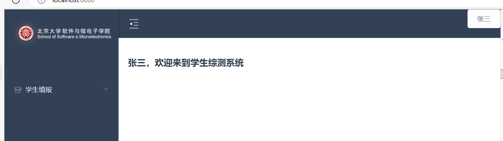

#### 登陆页面&验证码
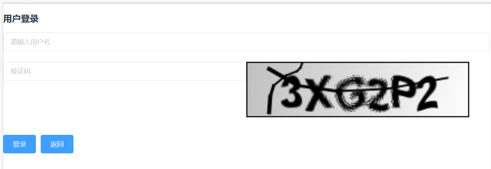

#### 学生板块
- 个人学年总结
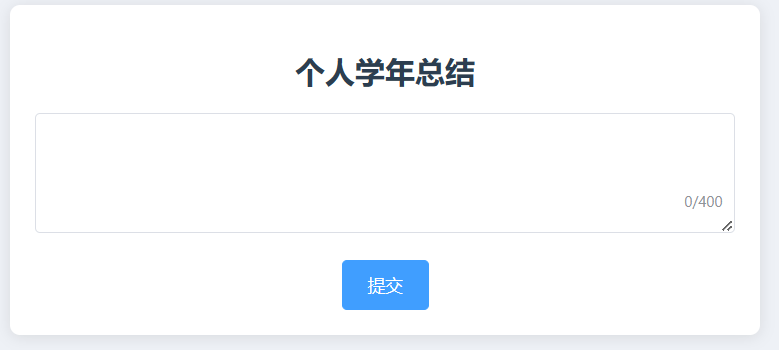
- 查看志愿时长和gpa
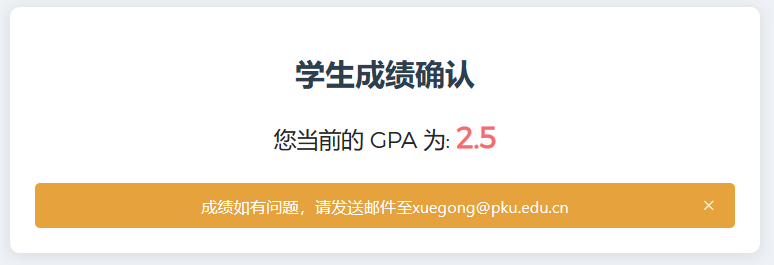
- 填写科研情况、学生骨干服务、社会实践
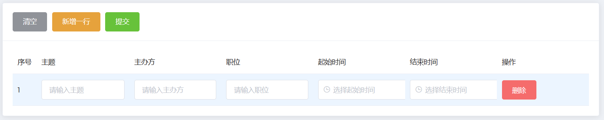

#### 评委板块
- 给各个板块评分
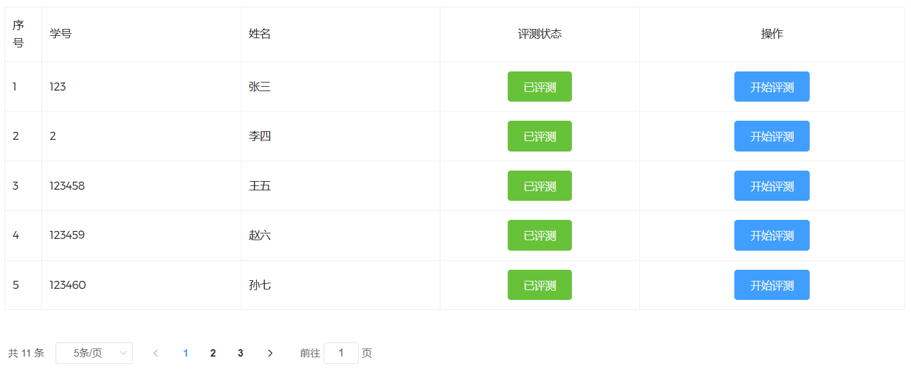
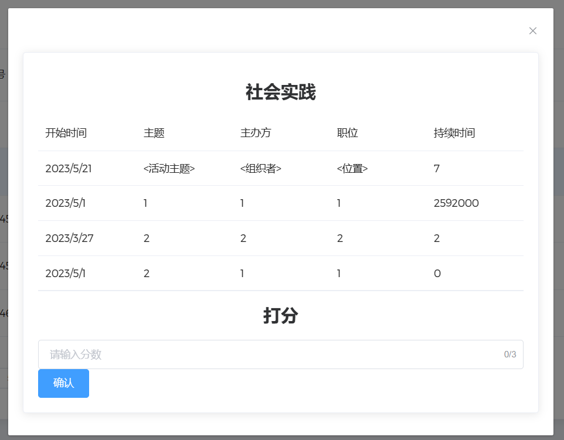
#### 学工版块
- 导入学生名单
- 汇总和导出学生最终成绩

#### 访问控制
根据不同的身份登陆后显示不同的菜单
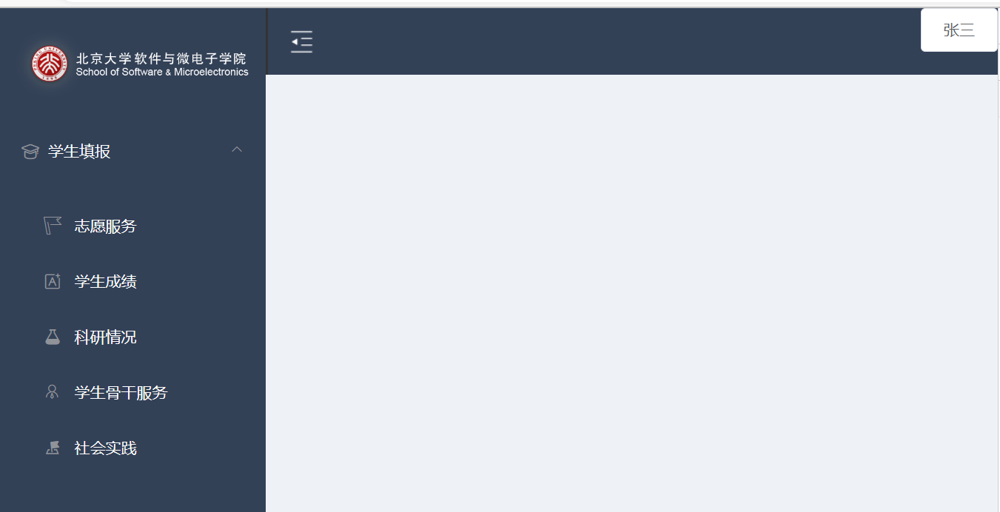
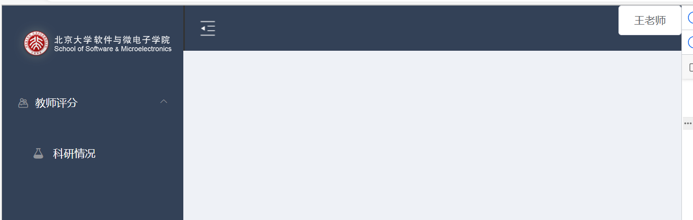
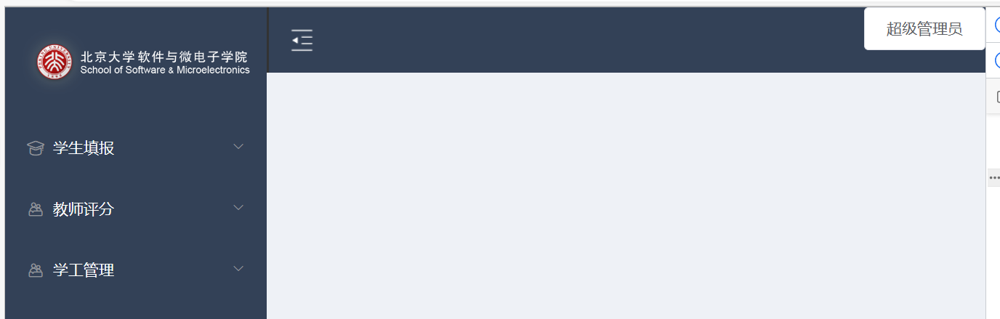
当用户试图访问不属于自己权限的页面时提示错误
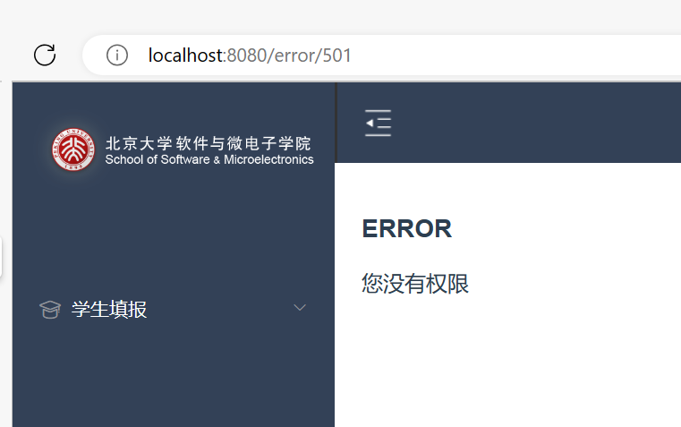

